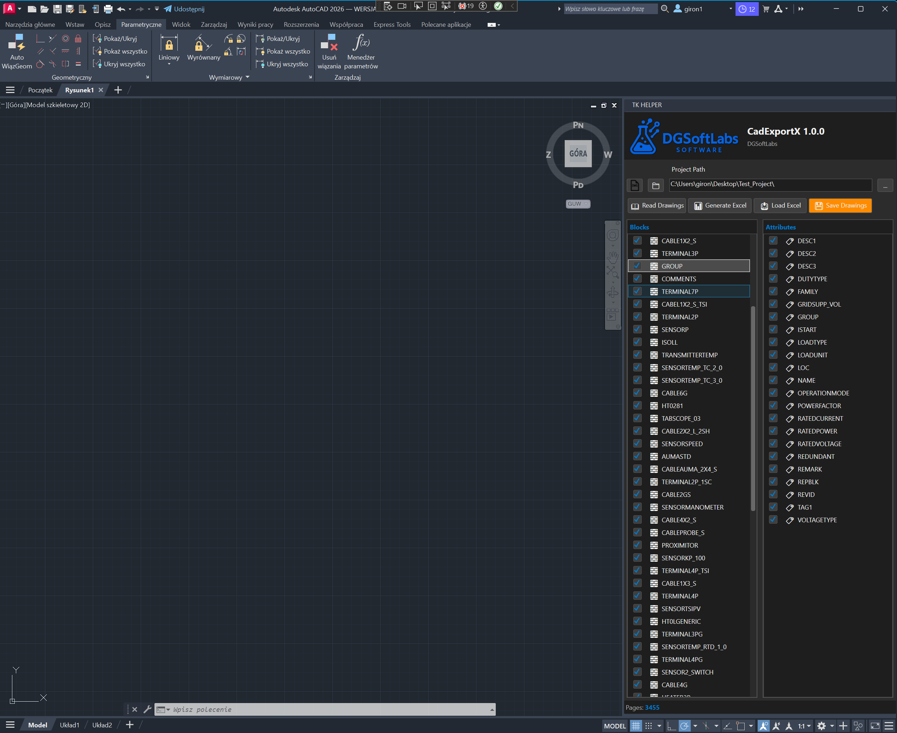

# CadExportX

## Description

**CadExportX** is an AutoCAD plugin designed to **dramatically accelerate workflow in engineering projects** created in AutoCAD. The application addresses a common challenge in large-scale technical documentation: managing and editing block attributes across hundreds or thousands of drawings.



### The Problem It Solves

In typical engineering projects (especially electrical, mechanical, or process engineering), technical drawings contain numerous blocks with attributes that need frequent updates. Making changes manually across multiple drawings is:
- **Time-consuming** - opening each drawing individually takes hours or days
- **Error-prone** - manual editing increases the risk of inconsistencies
- **Difficult to track** - hard to maintain an overview of all elements across the project

### The Solution

CadExportX provides a **bidirectional bridge between AutoCAD drawings and Excel**, enabling engineers to:

1. **Extract block attributes** from all DWG files in the project into a single, organized database
2. **Export to Excel** for easy viewing, filtering, and editing using familiar spreadsheet tools
3. **Edit attributes in Excel** - make bulk changes, use formulas, apply consistent formatting
4. **Import changes back** and automatically update all affected drawings in one operation

This workflow transforms what would take days of manual work into minutes of automated processing.

### Main Purpose

The plugin was created to:

- **Mass extraction of block attributes** - automatically read parameters from blocks across multiple DWG files simultaneously
- **Seamless Excel integration** - generate structured Excel spreadsheets with all block data for easy manipulation
- **Bidirectional synchronization** - support both:
  - **Online editing** - direct changes to Excel that can be imported back
  - **Offline workflow** - export, edit externally, and re-import when ready
- **Batch updates** - apply changes to hundreds of blocks across dozens of drawings in a single operation
- **Multi-page, multi-block editing** - make consistent changes across entire projects without opening individual drawings
- **Manage AutoCAD Electrical projects** - handle `.wdp` projects with automatic folder structure detection

### Key Features

#### 1. **Drawing Database Update**
Scans all DWG files in the project and creates a comprehensive database of blocks with their parameters. Supports:
- Standard AutoCAD blocks with attributes
- Dynamic blocks
- AutoCAD Electrical projects (`.wdp` format)
- Hierarchical folder structures

#### 2. **Excel List Generation**
Exports block data to Excel spreadsheet with:
- Automatic column generation based on block attributes
- Filtering and sorting capabilities
- Custom parameter selection
- Frozen header rows for easy navigation
- Color-coded system columns

#### 3. **Excel Import (Bidirectional Sync)**
Two workflows supported:
- **Live editing** - Excel file automatically saves changes back to the database
- **Import mode** - select any Excel file to import updated values

Changes are tracked and validated before being written to drawings.

#### 4. **Batch Save to Drawings**
Applies all changes from the database back to the original DWG files:
- Preserves drawing integrity
- Updates only modified attributes
- Processes files in background
- Progress tracking and error reporting

#### 5. **Helper Tools**
Specialized commands for common tasks:
- Terminal numbering with custom patterns
- Cable pair numbering (alternating colors)
- Sequential cable numbering
- Alternating text descriptions

#### 6. **DWG Inspector**
Built-in tool for viewing and analyzing dynamic block properties without opening the drawing.

### Typical Workflow

```
1. Set Project Directory
   └─> Select folder with your DWG files

2. Update Database
   └─> Plugin scans all drawings and reads block attributes
   └─> Database saved for quick access

3. Configure Export
   └─> Select which block types to include
   └─> Choose which attributes to export

4. Generate Excel List
   └─> Structured spreadsheet created with all data
   └─> File saved to project's "Lists" folder

5. Edit in Excel
 └─> Use Excel's powerful tools (formulas, find/replace, etc.)
   └─> Make changes to hundreds of blocks simultaneously
   └─> Save the file

6. Import Changes
   └─> Load the modified Excel file
   └─> Changes validated and imported to database

7. Save All Drawings
   └─> Plugin applies changes to all affected DWG files
   └─> All drawings updated automatically
```

### Real-World Benefits

**Time Savings:**
- Manual editing: 2-3 days for 100 drawings → **5 minutes with CadExportX**

**Consistency:**
- Eliminate copy-paste errors across drawings
- Apply standardized naming conventions project-wide

**Collaboration:**
- Non-AutoCAD users can edit block data in Excel
- Easy data sharing with other departments

**Quality Control:**
- Quick overview of all elements in the project
- Easy to spot missing or incorrect data

### Technology Stack

- **.NET 8** (Windows)
- **AutoCAD API** (Autodesk.AutoCAD.*)
- **Microsoft Office Interop** (Excel)
- **WPF** (user interface with dark theme)

### UI Theme

The plugin uses a dark theme interface similar to AutoCAD, ensuring visual consistency with the host application and reducing eye strain during extended use.

---

## Installation

1. Load the plugin in AutoCAD using `NETLOAD` command
2. Select the `CadExportX.dll` file
3. The "TK Helper" palette will appear automatically

## Usage

### Quick Start

1. **Set Project Directory** - Click the folder icon and select the root folder of your AutoCAD project
2. **Update Database** - Click "Read All Drawings" to scan all DWG files
3. **Configure Blocks** - Select which block types should be included in the export
4. **Configure Attributes** - Choose which attributes to export for selected blocks
5. **Generate Excel List** - Click "Export to Excel" to create the spreadsheet
6. **Edit in Excel** - Make your changes and save the file
7. **Import Excel** - Click "Import from Excel" to load changes (or save directly if using live mode)
8. **Save All Drawings** - Click "Save All Drawings" to apply changes to DWG files

### Advanced Features

#### Block and Attribute Filtering
- Use "Select All" / "Deselect All" buttons for quick selection
- Enable only relevant block types to keep Excel files manageable
- Choose specific attributes to export (hide internal/system parameters)

## Project Structure

```
CadExportX/
├── CadExportX.csproj          # Main project file
├── ACadModel.cs               # Core plugin logic and AutoCAD API integration
├── ACadViewModel.cs      # MVVM ViewModel for UI
├── ACadView.xaml        # WPF user interface
├── AutoCADTheme.cs      # Dark theme styling
├── Elements/
│   └── DwgInspector.cs        # DWG inspector tool
└── README.md            # This file
```

## Requirements

- AutoCAD 2020 or newer
- .NET 8 Runtime
- Microsoft Excel (for Excel export/import features)
- Windows operating system

## License

This project is licensed under the terms specified in the repository.

## Contributing

Contributions are welcome! Please feel free to submit issues or pull requests.

## Support

For questions or issues, please open an issue on the GitHub repository.
